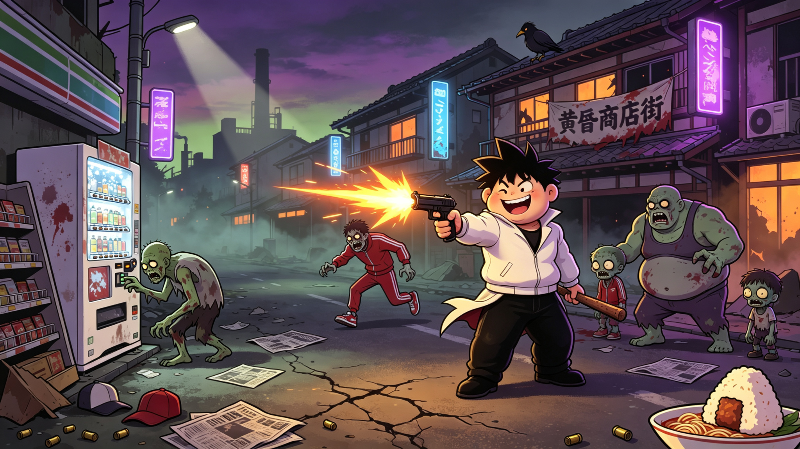

# 🔥 热血物语：末日丧尸（Hot-Blood Zombie）

> **不良少年 × 丧尸末日 × 热血格斗** —— 2.5D 横版清版动作游戏
> 灵感致敬热血系列（くにおくん）的校园不良群架与街头闹剧，全部内容原创，免费开源。

[](https://github.com/qq1375828505/hot-blood-zombie/actions/workflows/godot-ci.yml)
[](LICENSE)
[](https://godotengine.org)
[](#下载安装)



黄昏町爆发神秘病毒，街头的同学、暴走族、学生会集体变成了"丧尸不良"。
你——热血高校的最后一批不良少年，带着兄弟抄起铁管、轮胎和垃圾桶盖，一路打回校园、打穿商店街、打进白岳制药工厂深处。不打枪的枪战游戏，拳头和街头道具才是主角。

---

## 🎮 玩法亮点（热血化核心）

| 系统 | 说明 |
|---|---|
| **拳脚连招为主力** | A 拳 3 段、B 脚 2 段、跳踢、冲刺拳，拳脚交替第 3 击伤害 ×1.5 |
| **日用品武器** | 铁管 / 轮胎 / 垃圾桶盖随处可捡，有耐久、会脱手；垃圾桶盖能格挡减伤 |
| **枪是稀有掉落** | 手枪 / 冲锋枪 / 霰弹枪 / 手雷只在精英与 Boss 身上 15% 掉落，弹药宝贵 |
| **人形敌会"人味"** | 丧尸化不良会发呆、偷吃、看表、对空气争论、两只互殴记仇追打 |
| **打残收服** | 近战打残 → 抱头求饶 → 收为援护召唤，帮你冲撞敌人 |
| **根性気力** | 被打趴不死，消耗気力站起喘气继续打（热血物语招牌） |
| **必杀 = 个人武技** | 马赫踢 / 马赫拳 / 大地震击 / 旋风踢 / 人间鱼雷，书店买书永久习得 |
| **兄弟连携** | AI 2P 全程跟随，合体技范围清场、倒地救援、挡枪 |
| **Boss 是人** | 暴走族总长·鬼冢、学生会会长·白岳——格斗技、嘲讽、叫人，跪姿遗言 |

## 👥 可选角色（5 名，特性差异化）

| 角色 | 定位 | 特性 |
|---|---|---|
| 国夫·转生（原创） | 均衡 | 马赫踢必杀，数值全面 |
| 阿力·改（原创） | 攻速 | 马赫拳更快，出拳第 1 击伤害高 |
| 疾风 | 速度 | 移动更快，跳踢伤害加成 |
| 铁壁 | 力量 | 血厚防高，垃圾桶盖格挡更强 |
| 暴走族总长·鬼冢 | 隐藏 | 通关解锁，人间鱼雷（最贵但最弱，致敬热血反差梗） |

## 🗺️ 关卡（5 章，日常被丧尸扭曲）

1. **黄昏町·鞋柜区** —— 开局异变，街边自动贩卖机打爆掉补给
2. **白鹰高中·教室走廊** —— 课桌椅当掩体，鞋柜翻出装备
3. **天台与体育馆** —— 篮球当投掷物，体育器材全变武器
4. **商店街·霓虹夜** —— 商店、霓虹灯、夜市摊位，丧尸化的暴走族聚集地
5. **白岳制药·工厂终局** —— 格斗竞技场擂台，最终 Boss 学生会会长

## 🧱 技术栈

- **引擎**：Godot 4.3（GDScript，gl_compatibility 渲染，1280×720 画布）
- **目标平台**：Android（首发，arm64）/ Windows / macOS / Web 同一套工程
- **存档**：user:// JSON，schema 版本化自动迁移
- **扩展性**：数据驱动（角色 / 关卡 / 商店 / Buff / 成就 / 武器表全部外置），`dlc_registry.gd` 注册表预留 DLC 与变体系统挂载点

## 📥 下载安装

- **安卓 APK**：进入 [Releases](https://github.com/qq1375828505/hot-blood-zombie/releases) 下载最新版（debug 签名，可直接安装试玩）
- **本地运行**：安装 Godot 4.3 → 打开 `project.godot` → 按 F5
- **桌面操作**：A/D 移动，W/空格 跳，S 下蹲，J 射击，K 近战，L 必杀，R 重开
- **移动端**：左侧虚拟摇杆 + 右侧跳跃 / 下蹲 / 射击 / 近战 / 必杀 / 重开触屏键，HUD 按 6.9 寸横屏安全区适配；2P 为 AI 人机（单机）

## ⚙️ GitHub Actions 自动打包

推送到 `main` 自动执行：导入检查 → 50 项冒烟测试 → 安卓 APK 导出（debug 签名）并上传构建产物；
打 `v*.*.*` tag 自动发布 GitHub Release 附带 APK。**本地无需任何打包环境。**

```bash
git push origin main          # 自动跑测试 + 出 APK 产物
git tag v0.2.0 && git push origin v0.2.0   # 发布 Release
```

## 🗓️ Roadmap

- [x] V1.0 首版内容：真实 HUD、2 头身角色、武器、首关、热血四特点
- [x] V1.1 载具 / 收服 / 半尸化
- [x] V1.2 选人 / 商店 / 三关 / 成就存档
- [x] V1.3 怪物战斗深度：吸血、躲避、扛伤、精英、Boss 磨血战
- [x] V2.0 白岳制药工厂 + 终章最终 Boss + DLC 注册表
- [x] V2.1 热血化战斗：拳脚主力 + 日用品武器 + 敌人人味化
- [x] V2.2 兄弟连携 + 根性気力 + 必杀个人武技 + 场景日常化
- [x] V2.3 Boss 人形格斗战 + 2 头身视觉 + 格斗竞技场
- [ ] 音效与 BGM（8-bit chiptune + 进行曲融合方向已定）
- [ ] 更多关卡与 Boss、难度档位、评分挑战

## 📄 开源许可

[MIT License](LICENSE) —— 免费开源，自由学习、修改、二创。游戏名与内容为原创致敬，不包含热血系列与合金弹头的任何商业素材。

**热血物语：末日丧尸** · 免费二创 · 用拳头和垃圾桶盖，打穿丧尸末日。
